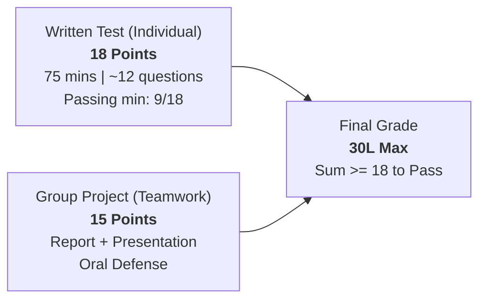

# Large Language Models for Software Engineering (LLM4SE)

[](https://www.polito.it/)
[](https://didattica.polito.it/)
[](STUDY_GUIDE/lectures/main.pdf)
[](STUDY_GUIDE/laboratories/labs.pdf)
[-purple.svg?style=flat)](EXAMS/)
[](STUDY_GUIDE/tests/)

Comprehensive study materials, publication-grade LaTeX study guides, past exam resolutions with complete step-by-step mathematical solutions, laboratory implementations, and lecture resources for the Master's degree course **Large Language Models for Software Engineering** at **Politecnico di Torino** (A.A. 2026/2027).

---

## ⚡ Quick Downloads & Direct Links

All documents are pre-compiled and ready for direct download:

| Resource | Description | Format | Direct Download |
| :--- | :--- | :---: | :---: |
| 📘 **Volume I: Theoretical Foundations** | Complete lecture study guide (96 pages) covering n-grams, deep learning foundations, word embeddings, recurrent neural networks, and modern transformers with full mathematical derivations and TikZ architectures. | PDF | [⬇️ Download Theory Guide (PDF)](https://github.com/Beccaceci/LLMs-for-Software-Engineering/raw/main/STUDY_GUIDE/lectures/main.pdf) |
| 🔬 **Volume II: Laboratory Practicum** | Comprehensive practical guide (27 pages) covering PyTorch internals, computational graphs, autograd, feed-forward CNNs, and sequence modeling. | PDF | [⬇️ Download Lab Guide (PDF)](https://github.com/Beccaceci/LLMs-for-Software-Engineering/raw/main/STUDY_GUIDE/laboratories/labs.pdf) |
| 📦 **Past Exams Archive (2025–2026)** | Single compressed archive containing all 8 past exam PDF resolutions and complete LaTeX sources. | ZIP | [⬇️ Download All Past Exams (ZIP)](https://github.com/Beccaceci/LLMs-for-Software-Engineering/releases/download/v1.0.0/past_exams_2025_2026.zip) |

---

## 📝 Past Exam Resolutions Archive (2025–2026)

Every past exam includes the official exam questions along with exhaustive theoretical, mathematical, and algorithmic worked solutions:

| Academic Year | Session Date | Session Name | Pages | Solved PDF | Source TeX |
| :---: | :---: | :---: | :---: | :---: | :---: |
| **2026** | **2026-08-31** | Fall Session | 26 | [📄 exam\_2026-08-31.pdf](EXAMS/2026/exam_2026-08-31/exam_2026-08-31.pdf) | [🔗 .tex](EXAMS/2026/exam_2026-08-31/exam_2026-08-31.tex) |
| **2026** | **2026-06-19** | Summer Session I | 22 | [📄 exam\_2026-06-19.pdf](EXAMS/2026/exam_2026-06-19/exam_2026-06-19.pdf) | [🔗 .tex](EXAMS/2026/exam_2026-06-19/exam_2026-06-19.tex) |
| **2026** | **2026-02-19** | Winter Session II | 23 | [📄 exam\_2026-02-19.pdf](EXAMS/2026/exam_2026-02-19/exam_2026-02-19.pdf) | [🔗 .tex](EXAMS/2026/exam_2026-02-19/exam_2026-02-19.tex) |
| **2026** | **2026-01-30** | Winter Session I | 23 | [📄 exam\_2026-01-30.pdf](EXAMS/2026/exam_2026-01-30/exam_2026-01-30.pdf) | [🔗 .tex](EXAMS/2026/exam_2026-01-30/exam_2026-01-30.tex) |
| **2025** | **2025-09-03** | Fall Session | 24 | [📄 exam\_2025-09-03.pdf](EXAMS/2025/exam_2025-09-03/exam_2025-09-03.pdf) | [🔗 .tex](EXAMS/2025/exam_2025-09-03/exam_2025-09-03.tex) |
| **2025** | **2025-06-27** | Summer Session I | 28 | [📄 exam\_2025-06-27.pdf](EXAMS/2025/exam_2025-06-27/exam_2025-06-27.pdf) | [🔗 .tex](EXAMS/2025/exam_2025-06-27/exam_2025-06-27.tex) |
| **2025** | **2025-02-11** | Winter Session II | 18 | [📄 exam\_2025-02-11.pdf](EXAMS/2025/exam_2025-02-11/exam_2025-02-11.pdf) | [🔗 .tex](EXAMS/2025/exam_2025-02-11/exam_2025-02-11.tex) |
| **2025** | **2025-01-29** | Winter Session I | 23 | [📄 exam\_2025-01-29.pdf](EXAMS/2025/exam_2025-01-29/exam_2025-01-29.pdf) | [🔗 .tex](EXAMS/2025/exam_2025-01-29/exam_2025-01-29.tex) |

---

## 🎓 Course Information & Logistics

*(Extracted directly from the inaugural lecture transcription and syllabus)*

- **Institution**: Politecnico di Torino — Department of Control and Computer Engineering (DAUIN) / DBDMG
- **Instructors**:
  - **Prof. Flavio Giobergia** ([flavio.giobergia@polito.it](mailto:flavio.giobergia@polito.it))
  - **Prof. Riccardo Coppola** ([riccardo.coppola@polito.it](mailto:riccardo.coppola@polito.it))
- **Weekly Schedule**:
  - **Mondays**: 08:30 – 11:30 (Classroom 8)
  - **Wednesdays**: 11:30 – 13:00 (Classroom 1)
- **Pedagogical Format**:
  - There is no rigid separation between lectures and lab sessions. Theoretical classes and hands-on workshops (e.g. PyTorch, Hugging Face) share the available Monday/Wednesday slots. Students bring their own laptops for live coding.
  - All lectures are officially recorded on Zoom and made available on the didactic portal.
- **Office Hours**:
  - No fixed office hours; instructors are available before and after class, during breaks, or via appointment requested by email.

### 🎯 Prerequisites & Software Stack
- Strong proficiency in **Python** is expected from day one.
- Core frameworks utilized: **PyTorch**, **Hugging Face Transformers**, **scikit-learn**, **NumPy**, **Jupyter Notebooks**, and modern LLM APIs / open-source model inference backends.

---

## 📊 Exam Structure & Grading System

The final course grade is out of **33 points** (corresponding to $30\text{L}$), divided into two complementary mandatory components:



### 1. Written Exam (18 Points)
- **Format**: Individual, closed-book written examination.
- **Duration**: **75 minutes**.
- **Composition**: Typically **10 to 13 questions** (mix of closed-ended multiple choice and open-ended theoretical/derivation questions).
- **Scope**: Covers all foundational and applied topics from lectures and workshops.
- **Sufficiency Threshold**: Minimum **9 / 18 points** required to qualify for grade summation.

### 2. Group Project (15 Points)
- **Format**: Applied group project on software engineering applications of Large Language Models.
- **Team Size**: Groups proposed by students (or matched by instructors).
- **Topic Selection**: A list of project proposals is presented mid-semester; teams rank their top 3 preferences.
- **Deliverables**:
  1. A formal **Written Technical Report** describing methodology, architecture, and empirical evaluation.
  2. A **Final Presentation Slide Deck**.
  3. An **Oral Presentation and Defense** before Prof. Giobergia or Prof. Coppola.
- **Delivery Windows**: Can be submitted and defended in the **Winter session** (Jan/Feb), **Summer session**, or **Fall session**.
- **Important Note**: Project evaluations reset at the conclusion of each academic year; projects not delivered by the Fall session must be redone.

---

## 📚 Course Syllabus & Modules

The course bridges the gap between machine learning foundations and state-of-the-art software engineering workflows:

### Part I: Foundations of Large Language Models
1. **Introduction to Language Models**: Natural language probability spaces, joint sentence probabilities, autoregressive generation, $n$-gram models, Markov assumptions, bigram transition tables, data sparsity, context horizon limitations, and cross-entropy/perplexity metrics.
2. **Deep Learning Foundations**: Perceptrons, decision boundaries, multi-layer feed-forward networks, activation functions ($\sigma$, $\tanh$, ReLU, Leaky ReLU, GELU, Softmax), regression vs. classification losses (MSE vs. BCE/CCE), gradient descent, computational graphs, and backpropagation.
3. **Word Embeddings**: Limitations of one-hot representations, distributed semantic representations, Word2Vec architectures (Continuous Bag-of-Words and Skip-Gram), Hierarchical Softmax, Negative Sampling, cosine geometry on unit hyperspheres, subword tokenization (BPE, WordPiece, SentencePiece), and polysemy collapse.
4. **Recurrent Neural Networks**: Sequential modeling, Simple Recurrent Networks (Elman), Backpropagation Through Time (BPTT), the mathematical proof of vanishing/exploding gradients (Pascanu / Bengio), Long Short-Term Memory (LSTM), Gated Recurrent Units (GRU), Sequence-to-Sequence encoder-decoder architectures, and the fixed-vector information bottleneck.
5. **Transformer Architecture**: The paradigm shift to attention, Scaled Dot-Product Self-Attention, Multi-Head Attention, Positional Encodings (sinusoidal, learned, RoPE), Encoder-Decoder vs. Decoder-Only (GPT) vs. Encoder-Only (BERT) paradigms.
6. **Scaling Laws & Pre-training**: Empirical scaling laws (Kaplan et al., Hoffmann et al. Chinchilla), data-constrained scaling, compute-optimal training frontiers, pre-training corpora curation, and filtering.
7. **Instruction Tuning & Alignment**: Supervised Fine-Tuning (SFT), Reinforcement Learning from Human Feedback (RLHF), Proximal Policy Optimization (PPO), Direct Preference Optimization (DPO), and constitutional AI.
8. **PEFT & Inference Optimization**: Parameter-Efficient Fine-Tuning (LoRA, QLoRA, Prefix Tuning, Adapters), model quantization (GPTQ, AWQ, bitsandbytes), KV caching, and speculative decoding.

### Part II: Large Language Models for Software Engineering (LLM4SE)
9. **AI in Software Engineering Foundations**: The software engineering lifecycle, code representation models (ASTs, CFGs, PDGs), Codex, StarCoder, CodeLlama, and code-specific benchmarks (HumanEval, MBPP, SWE-bench).
10. **Prompt Engineering & Prompt Chaining**: Zero-shot, few-shot in-context learning, Chain-of-Thought (CoT), Tree of Thoughts (ToT), Self-Consistency, structured output enforcement, and Retrieval-Augmented Generation (RAG).
11. **AI Agents & Multi-Agent Architectures**: Autonomous agent reasoning loops (ReAct, Reflection), tool use, function calling, code sandboxes, and cooperative multi-agent SE teams.
12. **Automated Test Generation & Test Repair**: Test suite generation, test oracle synthesis, mutation testing with LLMs, automated bug reproduction, and self-healing test pipelines.
13. **Requirements Engineering & Software Modeling**: User story formalization, ambiguity detection in software specifications, and automated UML/sequence diagram synthesis.
14. **LLM-Assisted Code Refactoring & Maintainability**: Technical debt identification, code smell refactoring, automated documentation generation, and architecture compliance.
15. **Evaluation Methodologies for SE Tasks**: Execution-based evaluation (pass@k), syntactic/semantic similarity metrics (CodeBLEU), automated code review quality, and safety/security testing.
16. **Safety, Bias & Intellectual Property**: License contamination, copyright risks in training datasets, model hallucinations in mission-critical software, and adversarial jailbreaks.

---

## 📂 Repository Directory Layout

```text
.
├── README.md                           # Course guide, syllabus, exam info, and download portal
├── EXAMS/                              # Past written exam papers and complete resolutions
│   ├── 2025/                           # Academic Year 2024/2025 Exam Sessions
│   │   ├── exam_2025-01-29/            # Winter Session I (23 pages PDF + TeX)
│   │   ├── exam_2025-02-11/            # Winter Session II (18 pages PDF + TeX)
│   │   ├── exam_2025-06-27/            # Summer Session I (28 pages PDF + TeX)
│   │   └── exam_2025-09-03/            # Fall Session (24 pages PDF + TeX)
│   └── 2026/                           # Academic Year 2025/2026 Exam Sessions
│       ├── exam_2026-01-30/            # Winter Session I (23 pages PDF + TeX)
│       ├── exam_2026-02-19/            # Winter Session II (23 pages PDF + TeX)
│       ├── exam_2026-06-19/            # Summer Session I (22 pages PDF + TeX)
│       └── exam_2026-08-31/            # Fall Session (26 pages PDF + TeX)
├── STUDY_GUIDE/                        # Publication-grade LaTeX study guide sources
│   ├── lectures/                       # Volume I: Theoretical Foundations (main.pdf - 96 pages)
│   │   ├── chapters/                   # Modular syllabus chapters
│   │   ├── frontmatter/                # Titlepage, preface, and notation index
│   │   └── main.tex                    # Master LaTeX root document
│   ├── laboratories/                   # Volume II: Laboratory Practicum (labs.pdf - 27 pages)
│   │   ├── chapters/                   # Lab walkthroughs and exercises
│   │   └── labs.tex                    # Laboratory LaTeX root document
│   ├── shared/                         # Shared macros, styling (macros.sty), and references.bib
│   └── tests/                          # 86 automated structural, syntax, and E2E compiler tests
├── LABS/                               # 10 practical laboratory notebooks and exercises
│   ├── lab01/                          # PyTorch Foundations & Autograd
│   ├── lab02/                          # Word Embeddings & Semantic Vector Spaces
│   ├── ...                             # Recurrent Models, Transformers, PEFT/LoRA, RAG
│   └── lab10/                          # Multi-Agent Systems & Evaluation
├── SLIDES/                             # Official lecture slides (01 to 04)
└── TRANSCRIPTIONS/                     # Verbatim Whisper transcriptions of recorded lectures
```

---

## 🛠️ Building & Compiling the Study Guide

The study guides are typeset using standard LaTeX tools (`pdflatex`, `bibtex`, or `latexmk`).

### Prerequisites
Install a standard TeX Live distribution:
- **macOS**: `brew install --cask mactex`
- **Ubuntu/Debian**: `sudo apt install texlive-full`

### Compiling Volume I (Lectures)
```bash
cd STUDY_GUIDE/lectures
latexmk -pdf -interaction=nonstopmode main.tex
```
The compiled document will be output to `STUDY_GUIDE/lectures/main.pdf`.

### Compiling Volume II (Laboratories)
```bash
cd STUDY_GUIDE/laboratories
latexmk -pdf -interaction=nonstopmode labs.tex
```
The compiled document will be output to `STUDY_GUIDE/laboratories/labs.pdf`.

### Running Automated Test Suite
To verify LaTeX syntax, delimiter balancing, BibTeX reference integrity, and cross-references across all 16 chapters:
```bash
python3 -m pytest STUDY_GUIDE/tests/
```
```text
============================= 86 passed in 46.30s ==============================
```

---

## 📜 References & Recommended Reading

- **Foundational Literature**:
  - Vaswani et al. (2017), *Attention Is All You Need*
  - Mikolov et al. (2013), *Efficient Estimation of Word Representations in Vector Space*
  - Sennrich et al. (2016), *Neural Machine Translation of Rare Words with Subword Units*
  - Bengio et al. (1994), *Learning Long-Term Dependencies with Gradient Descent is Difficult*
  - Hu et al. (2021), *LoRA: Low-Rank Adaptation of Large Language Models*
  - Wei et al. (2022), *Chain-of-Thought Prompting Elicits Reasoning in Large Language Models*
- **Textbooks**:
  - Jurafsky & Martin, *Speech and Language Processing* (3rd ed. draft)
  - Bishop & Bishop (2024), *Deep Learning: Foundations and Concepts*
  - Prince (2023), *Understanding Deep Learning*
  - Goodfellow, Bengio, Courville (2016), *Deep Learning*

---

## 👤 Author & Acknowledgments

- **Nicola Beccaceci** — Master's Degree in Computer Engineering, Politecnico di Torino ([GitHub: @Beccaceci](https://github.com/Beccaceci))
- Course taught by **Prof. Flavio Giobergia** and **Prof. Riccardo Coppola**, DAUIN / DBDMG, Politecnico di Torino.
